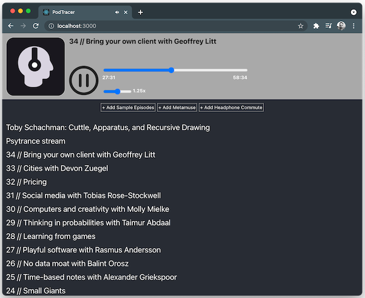

# PodTracer

PodTracer is **a simple web-based podcast player** built as a learning project during
my time at the [Recurse Center](https://www.recurse.com/).

Why another podcast player? Mostly I wanted a testbed for experimenting with **local-first user data** and decentralized sync technologies. A podcast player is something that (1) I can legitimately use while (2) not being too sad when I mess up and have to reset the data store.

It also gave me a way to get more familiar with React hooks and web media player APIs, and to generally see how far I could get without a server component.

You can try it for yourself via hosted versions on [Vercel](https://podtracer.vercel.app/) or [Fission](https://fun-long-angular-barista.fission.app/).

## Limitations
You should consider this an unsupported toy project. The biggest limitation is that due to [CORS](https://en.wikipedia.org/wiki/Cross-origin_resource_sharing) restrictions, client javascript code can't request most podcast/RSS feeds from other servers, so PodTracer comes with some hardcoded feed content to test with.

## Running

As a fairly basic React app, PodTracer can be run locally via `yarn start` and built for production with `yarn build` as usual.

PodTracer uses IndexedDB to persist your list of shows and playback state in your browers. When you first run it on a particular device, the list will be empty. Click one of the `+ Add...` buttons to add some sample episodes, then click one of them to play. The play progress and speed setting for each episode should be preserved even after reloading the page.

## Adding Episodes Via URL

There is one obscure way to add arbitrary episodes (or any audio file) to your browser's playback queue right now. To do this, create a url e.g.

`https://podtracer.vercel.app/` 
`?addepaudio=`_(the URL of the MP3 file, URL-encoded)_ 
`&addeptitle=`_(the title of the episode, URL-encoded)_ 
`&addepimage=`_(the URL of the episode image, URL-encoded)_ 
`&addepguid=`_(the GUID of the episode, URL-encoded, OPTIONAL)_ 
`&appepsourcetitle=`_(the title of the podcast/source, URL-encoded, OPTIONAL)_

For example, [this link](https://podtracer.vercel.app/?addepaudio=https%3A%2F%2Ftraffic.libsyn.com%2Fsecure%2Fcomputingup%2Fcomputingup-ep244-heather-lynch.mp3%3Fdest-id%3D723040&addeptitle=Computing%20Penguins%20with%20Heather%20Lynch%20-%2044th%20Conversation&addepimage=https%3A%2F%2Fssl-static.libsyn.com%2Fp%2Fassets%2F2%2Fd%2F0%2Fd%2F2d0d5ef7b5201531%2Fcomputingup-ep244-heather-lynch-10.jpg&addepguid=cf45451a-1711-4a28-8a89-377e25b0db59&addepsourcetitle=Computing%20Up) adds an episode of the [Computing Up](https://computingup.libsyn.com/) podcast to the Vercel-hosted version of PodTracer.